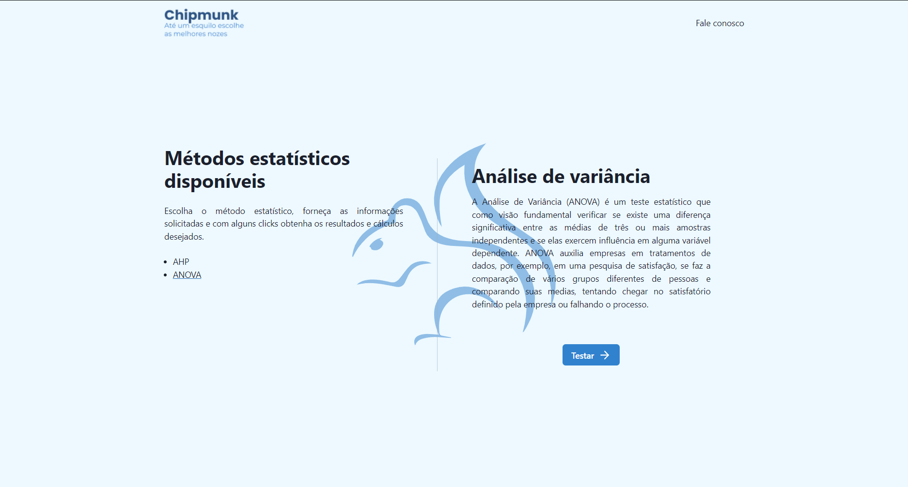
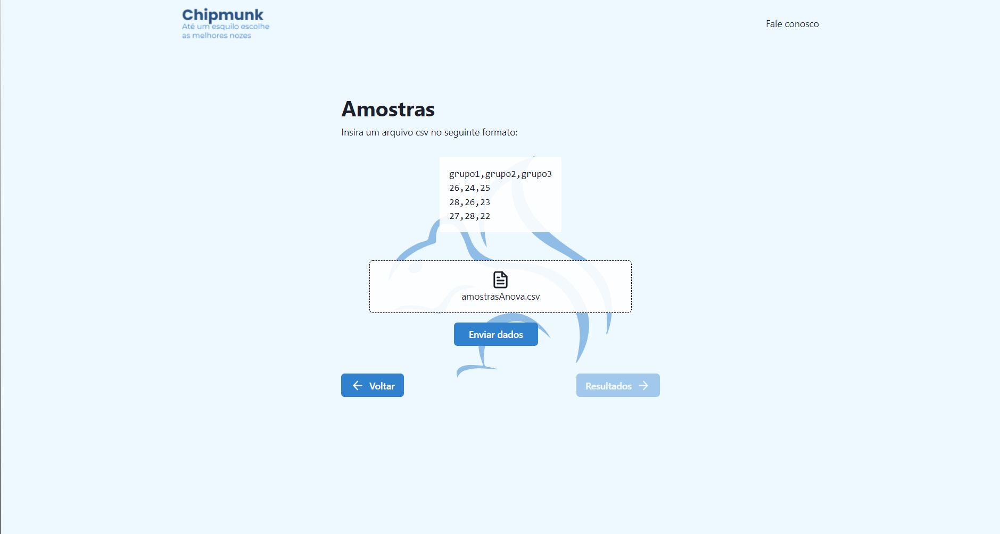
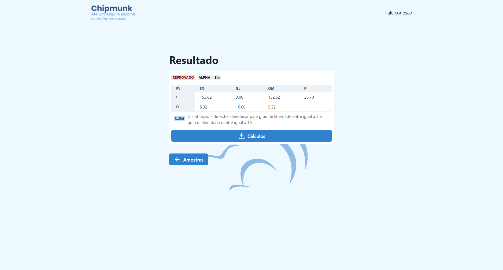
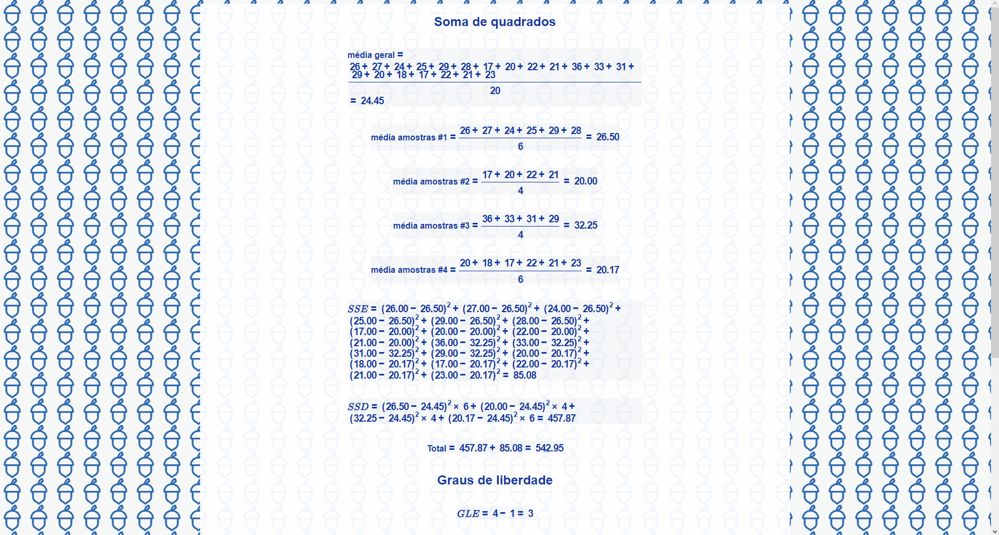

# Chipmunk

  O projeto consiste em um sistema que auxilia a tomada de decisão (AHP) e se há
alguma diferença entre as medianas dos diferentes grupos (ANOVA).

  Analytic Hierarchy Process — AHP (Método de Análise Hierárquica) é um método de
decisão multicritério desenvolvido para ajudar na tomada de decisão a partir de
uma série de fatores, sejam quantitativos ou qualitativos.

  Já one-way ANOVA (Análise de variância) é uma fórmula estatística usada para
comparar as variâncias entre as medianas (ou médias) de grupos diferentes,
ajudando a comparar essas medianas dos grupos para descobrir se eles são
estatisticamente diferentes ou semelhantes.

## Descrição

Este projeto foi desenvolvido com o intuido de facilitar o acesso e utilização
de métodos estatísticos veja como é simples!

- Escolha de um método estatístico:



- Upload de um arquivo csv com as informções que serão analisadas:



- Resultado:



- Cáculos realizados para chegar ao resultado:



## Principais Tecnologias

- [Next.js](https://nextjs.org)
- [Chakra-ui](https://chakra-ui.com)
- [Vercel](https://vercel.com)
- [Chipmunk-statistics-lib](https://github.com/DanielSLucas/chipmunk-statistics-lib)

## Como Executar o projeto

O projeto está disponível na seguinte url: https://chipmunk-beta.vercel.app.
Mas caso queira executar na sua máquina, faça o seguinte:

***Requer node instalado**


- Clone o projeto e entre na pasta dele:
```bash
  # Clone o projeto
  git clone https://github.com/DanielSLucas/Chipmunk.git

  # Entre na pasta do projeto
  cd Chipmunk
```

- Crie um arquivo `.env.local` na raiz do projeto, com as informações abaixo:
```
  NEXT_PUBLIC_URL=
```

- Instale as dependências do projeto e o execute:
```bash
  # Instale as dependências
  yarn # ou npm i

  # Execute o projeto
  yarn dev # ou npm run dev
```
